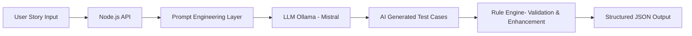
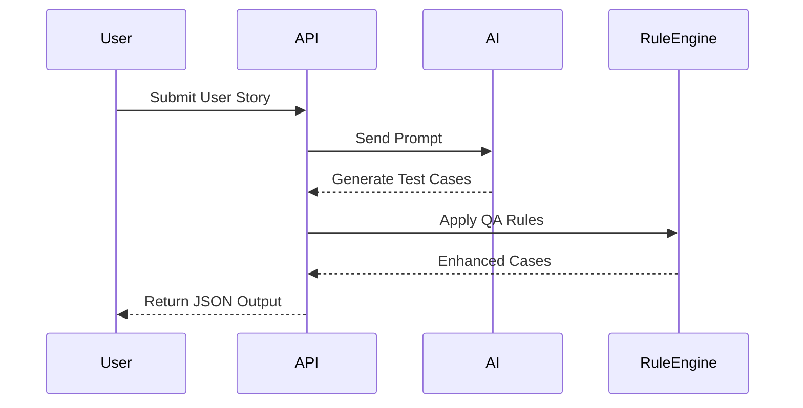

# 🚀 AI Test Case Generator

> AI-powered system that converts user stories into structured, production-ready test cases using LLMs + rule-based validation.

---

## 🧩 Problem Statement

Manual test case creation is:
- ⏳ Time-consuming
- ❌ Inconsistent across teams
- ⚠️ Prone to missing edge cases

> QA teams spend significant time designing test scenarios instead of focusing on quality improvements.

---

## 💡 Solution

This project introduces an **AI-assisted QA system** that:

✅ Converts user stories into structured test cases  
✅ Generates functional, negative, and edge scenarios  
✅ Enforces consistency via structured outputs  
✅ Uses **local LLM (no API cost)** for scalability  

---

## 🏗️ System Architecture

---
## 🔄 Execution Flow

---

## 🛠️ Tech Stack

| Layer        | Technology            |
| ------------ | --------------------- |
| Backend      | Node.js (Express)     |
| AI Engine    | Ollama (Mistral LLM)  |
| API Testing  | Postman / REST Client |
| Architecture | REST API              |

---

## ⚙️ Features

🧠 AI-powered test case generation
📋 Covers functional, negative & edge cases
🧾 Structured JSON output
💸 Zero-cost (local LLM via Ollama)
🔧 Extensible rule-based validation layer

---

## 🚀 Future Enhancements

- 📊 Test coverage analytics  
- 🔗 Jira/TestRail integration  
- 🤖 Automation script generation (Selenium/Playwright)  
- 🌐 Frontend dashboard  
- 🔍 Duplicate test detection  

---

## 💼 Why This Project Matters

This project demonstrates:

- AI integration in QA workflows  
- Backend system design  
- Prompt engineering  
- Scalable test automation thinking  
